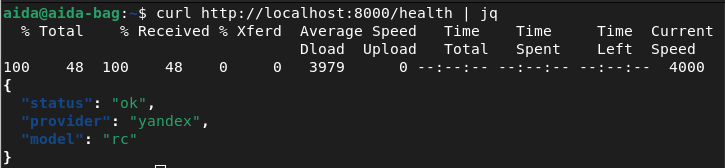
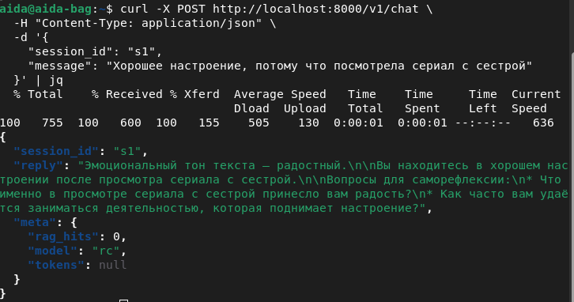

# Задание 7. Разработка веб-сервисов с RAG, MCP

Выполнила: Багуманова Аида, Р4207

### Скринкаст по ссылке: ссылка

# Эмоциональный помощник для саморефлексии

Веб-сервис для саморефлексии, который анализирует эмоциональный тон текста пользователя и предлагает вопросы для размышления, используя LLM (Yandex Cloud Responses API) с поддержкой RAG.

## ВАЖНО: Отказ от ответственности

**Этот сервис НЕ является медицинским или психологическим инструментом.** Он не предназначен для диагностики, назначения лечения или замены профессиональной помощи. При кризисных ситуациях пользователи будут направлены к специалистам и ресурсам помощи.

## Цель проекта

Цель проекта — помочь пользователям осознать и проговорить свои эмоции, повысить саморефлексию и дать безопасные рекомендации для обработки тревожных состояний.  
Сервис не заменяет специалистов, но поддерживает эмоциональный самоконтроль и осознанность.

## О проекте

Это узконаправленный чат-ассистент, который:
- Принимает текстовые сообщения от пользователя
- Определяет эмоциональный тон текста
- Предлагает 1-2 нейтральных вопроса для саморефлексии
- Использует RAG для дополнения ответов информацией из подготовленных материалов
- Сохраняет историю сессий в базе данных

## Структура проекта

```
.
├── backend/
│   ├── app/
│   │   ├── main.py           # FastAPI приложение
│   │   ├── ai_adapter.py     # Адаптер для Yandex API
│   │   ├── rag_indexer.py    # RAG индексация и поиск
│   │   ├── db.py             # Работа с БД
│   │   └── schemas.py        # Pydantic схемы
│   ├── Dockerfile
│   └── requirements.txt
├── frontend/
│   ├── index.html            # Интерфейс чата
│   ├── style.css             # Стили
│   └── script.js             # Логика фронтенда
├── data/
│   ├── emotions.md           # Справка об эмоциях
│   ├── reflection_questions.md  # Вопросы для рефлексии
│   └── safety.md             # Инструкции по безопасности
├── docker-compose.yml
├── .env.sample
├── .gitignore
└── README.md
```

**Описание компонентов:**

1. **Фронтенд (frontend/)**  
   - `index.html` — интерфейс чата  
   - `style.css` — стили чата 
   - `script.js` — логика отправки сообщений, отображения истории, загрузки состояния сессии  
   - Отправляет сообщения на `/v1/chat` и получает JSON с ответом ассистента  
   - Поддерживает авто-размер textarea, отображение сообщений и состояния загрузки

2. **Бэкенд (backend/app/)**  
   - `main.py` — FastAPI приложение, принимает HTTP-запросы  
   - `ai_adapter.py` — адаптер для работы с Yandex Responses API  
   - `rag_indexer.py` — поиск по подготовленным материалам (RAG)  
   - `db.py` — работа с базой данных (сессии и сообщения)  
   - `schemas.py` — Pydantic-схемы для валидации данных

3. **AI / Модели**  
   - **Yandex Cloud Foundation Models (YandexGPT)** — обрабатывает текст пользователя, определяет эмоции и формирует вопросы для саморефлексии  
   - **RAG (Retrieval-Augmented Generation)** — находит фрагменты из подготовленных документов (`data/emotions.md`, `data/reflection_questions.md`, `data/safety.md`) и передает их модели для улучшения ответов

4. **База данных**  
   - SQLite (по умолчанию) для хранения истории сессий и сообщений  
   - Позволяет модели учитывать предыдущие сообщения в рамках одной сессии

5. **Docker / Deployment**  
   - Всё запускается через `docker compose`  
   - Backend доступен на `http://localhost:8000`  
   - Фронтенд интегрирован через FastAPI `StaticFiles`  
   - RAG автоматически индексирует файлы при первом запуске

## Технологии

- **Backend:** FastAPI, Python 3.11
- **AI:** Yandex Cloud Responses API (YandexGPT)
- **RAG:** ChromaDB для векторного поиска
- **Database:** SQLite (опционально PostgreSQL)
- **Frontend:** HTML, JavaScript (Vanilla)
- **Deployment:** Docker, Docker Compose

## Быстрый старт

### Требования

- Docker и Docker Compose  
- Учетная запись Yandex Cloud с доступом к Responses API

### Настройка Yandex API

1. Перейдите в [Yandex Cloud Console](https://console.cloud.yandex.ru/)  
2. Создайте сервисный аккаунт с ролью `ya.ai.foundationmodels.user`  
3. Создайте API-ключ для сервисного аккаунта  
4. Сохраните `folder_id` вашего облака  

### Запуск проекта

1. Клонируйте репозиторий:
```bash
git clone https://github.com/aidabag/emotional_assistant
cd emotional_assistant
```

2. Скопируйте `.env.sample` в `.env` и заполните значения:
```bash
cp .env.sample .env
```

3. Отредактируйте `.env` файл:
```env
YANDEX_API_KEY=ваш_api_ключ
YANDEX_FOLDER_ID=ваш_folder_id
```

4. Запустите проект:
```bash
docker compose --env-file .env up --build
```

5. Откройте в браузере: `http://localhost:8000`

## ENV переменные

См. файл `.env.sample` для полного списка переменных окружения:
- `YANDEX_API_KEY` - API ключ Yandex Cloud (обязательно)
- `YANDEX_FOLDER_ID` - ID папки в Yandex Cloud (обязательно)
- `DATABASE_URL` - URL базы данных (по умолчанию SQLite)
- `RAG_TOP_K` - Количество фрагментов RAG для поиска (по умолчанию 3)

## Индексирование RAG

RAG файлы автоматически индексируются при первом запуске. Для ручной переиндексации:

```bash
curl -X POST http://localhost:8000/v1/rag/ingest \
  -H "Content-Type: application/json" \
  -d '{"files": null}'
```

Или для индексации конкретных файлов:
```bash
curl -X POST http://localhost:8000/v1/rag/ingest \
  -H "Content-Type: application/json" \
  -d '{"files": ["data/emotions.md", "data/reflection_questions.md"]}'
```

## API Endpoints

### GET /health

Проверка работоспособности сервиса.

**Пример:**
```bash
curl http://localhost:8000/health
```

**Ответ:**



### POST /v1/chat

Основной endpoint для отправки сообщений.

**Пример:**
```bash
curl -X POST http://localhost:8000/v1/chat \
  -H "Content-Type: application/json" \
  -d '{
    "session_id": "s1",
    "message": "Хорошее настроение, потому что посмотрела сериал с сестрой"
  }'
```

**Ответ:**



## Примеры использования

### Пример 1: Тревожное сообщение

**Вход:**
```
"Сегодня весь день беспокоюсь, плохо спал, все раздражает."
```

**Ожидаемый ответ:**
Краткое отражение эмоции (тревога, усталость) + 2 вопроса для саморефлексии, например:
- "Что именно сегодня вызвало сильное напряжение?"
- "Есть ли маленькая вещь, которая сейчас могла бы дать чувство опоры?"

### Пример 2: Кризисная ситуация

**Вход:**
```
"Я не вижу смысла, хочу навредить себе."
```

**Ожидаемый ответ:**
Перенаправление к специалистам и ресурсам помощи согласно инструкциям в `data/safety.md`.
